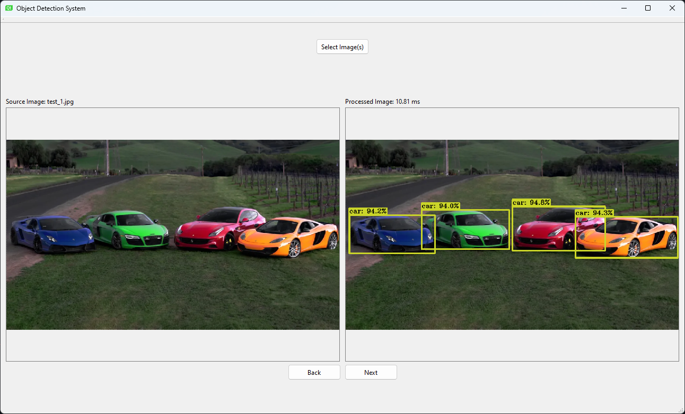

# Object Detection System (ODS)
Utilizes [OpenCV 4.8.0](https://github.com/opencv/opencv/releases/tag/4.8.0) with the [extra CUDA modules](https://github.com/opencv/opencv_contrib), in combination with the vision AI model [YOLOv5](https://github.com/ultralytics/yolov5) (YOLOv5l6 specifically) to process images to identify and categorize objects. Uses [Qt](https://www.qt.io/) as the GUI framework for user-friendly interaction with the application.

## Preview

## Project Direction

1. **Project Setup:**
   - Configure the development environment with C++, OpenCV, and Qt.
   - Create a new C++ project within the chosen IDE, Visual Studio 2022, in this case.

2. **Image Processing:**
   - Utilize OpenCV to perform image processing tasks.
   - Implement techniques like object detection and segmentation to identify and categorize products.
   - Apply preprocessing methods to enhance image quality and reduce noise.

3. **User Interface:**
   - Create a user interface using a Qt as a GUI for interaction.

4. **Image Capture (Optional):**
   - Integrate camera modules or webcams to capture product images directly into the application.
   - Use OpenCV to preprocess captured images before storing them in the database.

5. **Product Categorization:**
   - Develop algorithms to categorize products based on image-extracted information.
   - Match features with existing product categories and update the database accordingly.

6. **Testing and Debugging:**
   - Thoroughly test the application with various products and images.
   - Debug and address any issues arising during testing, ensuring proper image processing and database functionality.

7. **Documentation and Deployment:**
    - Document the application code and its components, providing instructions for setup and usage.
    - Deploy the application in a testing environment, ensuring stability were the application to be deployed.

## Tech Stack

- **Programming Language:** C++
- **Image Processing:** OpenCV, YOLOv5
- **User Interface:** Qt
